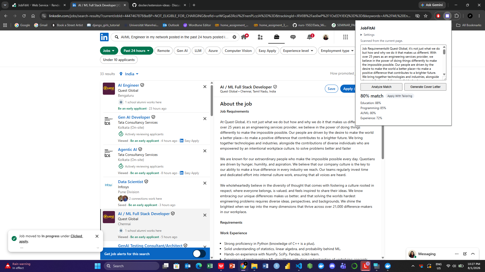
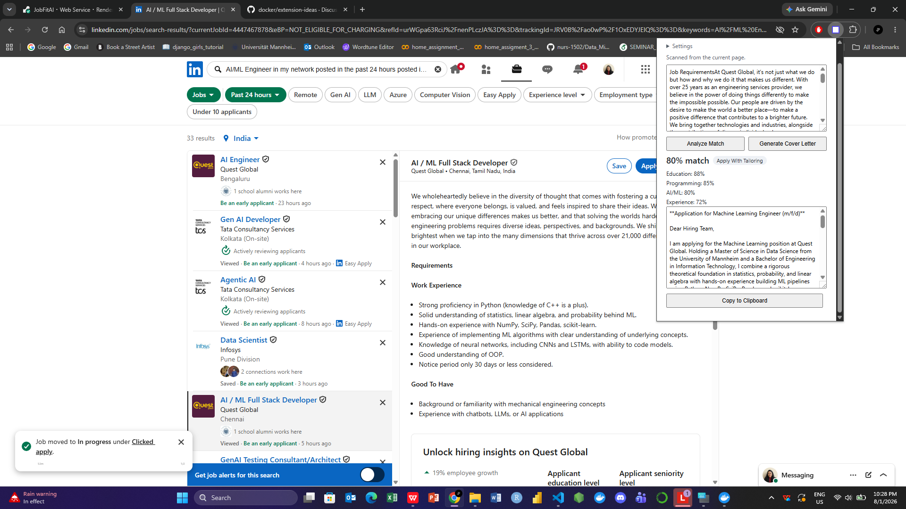
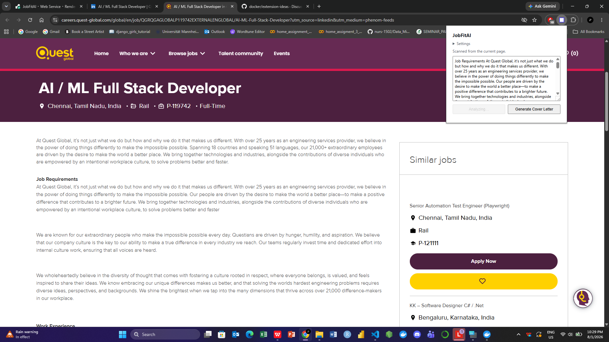
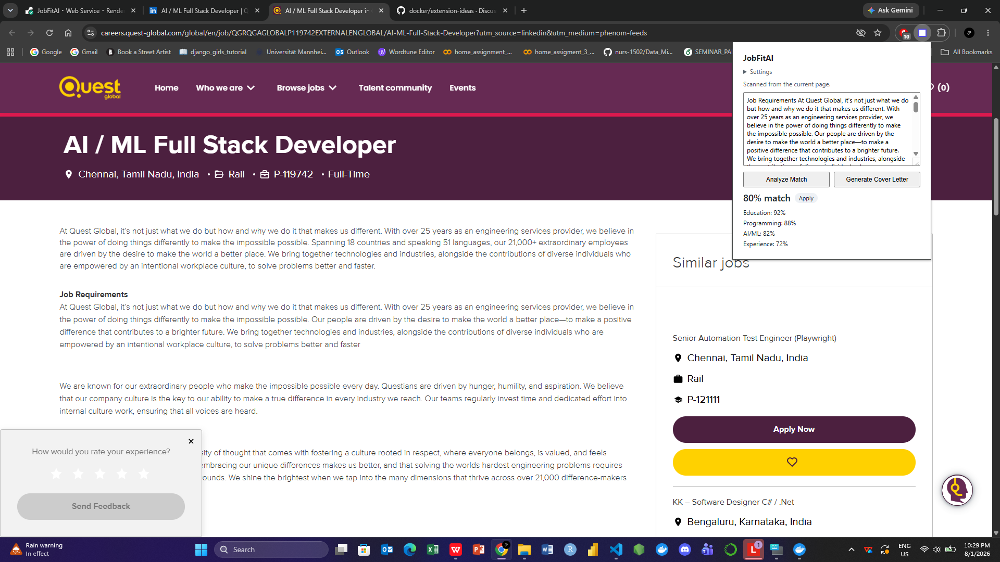
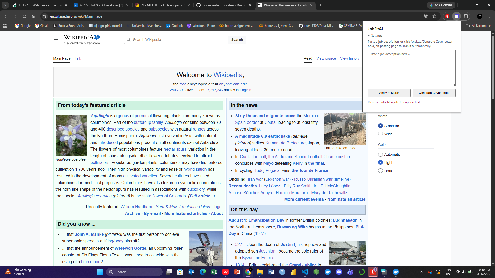
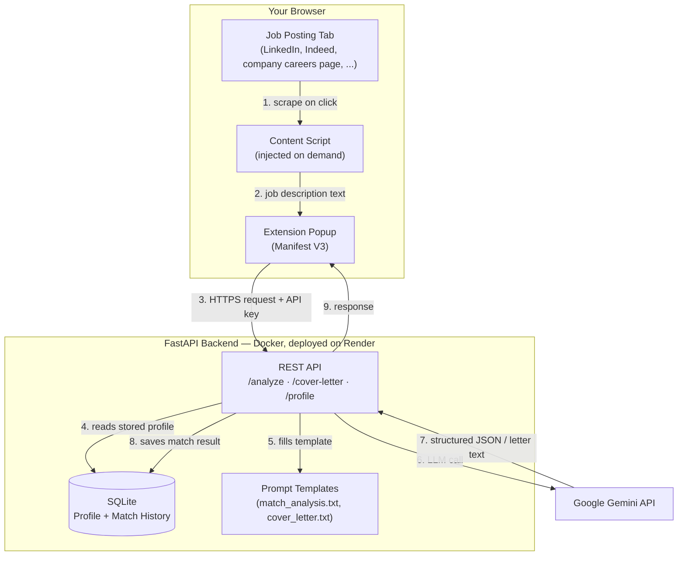

# JobFitAI

**Score any job posting against your profile and generate a tailored cover letter — in one click, from your browser.**

[](https://github.com/jahanv01/JobFitAI/actions/workflows/ci.yml)
[](LICENSE)

<p align="center">
  
</p>

---

## The Problem

Applying to jobs at scale means doing the same manual analysis over and over: open a job posting, copy the description, paste it into ChatGPT alongside your resume, ask whether it's a good fit, then ask again for a tailored cover letter. It works, but it's slow, repetitive, and easy to be inconsistent about — the tenth job posting of the day rarely gets the same careful comparison as the first.

## The Solution

JobFitAI turns that manual workflow into a single click. A Chrome extension reads the job description directly from whatever page you're on — a LinkedIn posting, an Indeed listing, or a company's own careers page which sends it to a backend that already knows your profile (education, skills, projects, experience, thesis/research, certifications), and returns:

- An **overall match percentage**, broken down by category (education, programming, AI/ML, experience)
- **Strengths and gaps** for that specific role, plus an apply/skip recommendation
- A **tailored cover letter**, written to lead with whichever part of your background is most relevant to that particular job which is copy-pasted straight into the application form

No more re-explaining your background to an AI chat window for every single posting.

## Key Features

- 🔍 **Works on any job site** — not just LinkedIn. A keyword-based heuristic detects whether the current page is actually a job posting before attempting to scrape it, so it never fires on unrelated pages.
- 📌 **Handles LinkedIn's list view correctly** — switching between job cards without a page reload always re-scrapes the currently selected job, not a stale one.
- ✍️ **Paste-box fallback** — if auto-detection doesn't work on a given site, you can always paste the description manually; nothing is ever silently overwritten.
- 📊 **Structured, explainable scoring** — not just a number: a category breakdown and named strengths/gaps you can actually act on.
- 📝 **One-click tailored cover letters** — with a copy-to-clipboard button, ready to paste into an application form.
- 🗂️ **Match history** — every analysis is saved server-side, so the data exists for a future dashboard.
- 🔒 **API-key protected backend** — safe to deploy publicly without leaving it open to the world.
- 🐳 **Containerized and CI-tested** — Docker Compose for local dev, GitHub Actions running lint + tests + a build check on every change, deployed to Render.

## See It In Action

<table>
  <tr>
    <td width="50%">
      
      <p align="center"><em>Tailored cover letters, one click away from the job posting.</em></p>
    </td>
    <td width="50%">
      
      <p align="center"><em>Works on a company's own careers page too — not just LinkedIn.</em></p>
    </td>
  </tr>
  <tr>
    <td width="50%">
      
      <p align="center"><em>Same job, same ~80% match — whether it's read from LinkedIn or the employer's own site.</em></p>
    </td>
    <td width="50%">
      
      <p align="center"><em>The keyword-gate heuristic at work: on a non-job page (Wikipedia here), it correctly declines instead of scraping something meaningless.</em></p>
    </td>
  </tr>
</table>

## System Architecture



**Why it's built this way:**
- The content script only ever runs *on demand* (when you click Analyze/Generate Cover Letter), not passively on every page you visit — better for privacy, performance, and avoiding Chrome's broad "read and change all your data on all websites" permission warning.
- Prompt templates are plain text files, not hardcoded strings in Python — they can be edited and reused without touching application code.
- The LLM's response is validated against an explicit schema before anything is persisted, so a malformed or off-spec model response fails loudly (as a clear error) instead of silently corrupting stored data.

## Tech Stack

| Layer | Technology |
|---|---|
| Backend | Python, FastAPI, SQLAlchemy, Pydantic, SQLite |
| AI | Google Gemini API |
| Browser Extension | Vanilla JavaScript, Chrome Manifest V3 |
| Infrastructure | Docker, Render, GitHub Actions (CI) |

## Getting Started

### Prerequisites

- Python 3.12+ (only if running without Docker)
- Docker + Docker Compose (recommended)
- A [Google Gemini API key](https://ai.google.dev/)
- Google Chrome (or another Chromium-based browser)

### 1. Clone the repo

```bash
git clone https://github.com/jahanv01/JobFitAI.git
cd JobFitAI
```

### 2. Configure the backend

```bash
cd backend
cp .env.example .env
```

Edit `.env` and fill in:
- `GEMINI_API_KEY` — your Gemini API key
- `API_KEY` — any random secret string the extension will use to authenticate (generate one with `python -c "import secrets; print(secrets.token_urlsafe(32))"`)

### 3. Run the backend

**With Docker (recommended):**
```bash
cd ..
docker compose up
```

**Without Docker:**
```bash
cd backend
python -m venv .venv && source .venv/bin/activate  # Windows: .venv\Scripts\activate
pip install -r requirements.txt
uvicorn main:app --reload
```

Either way, the API is now running at `http://localhost:8000`. Confirm with:
```bash
curl http://localhost:8000/health
```

### 4. Store your profile

The backend needs to know your background before it can score anything against it. See [`docs/profile-schema.md`](docs/profile-schema.md) for the full field reference, then:

```bash
curl -X POST http://localhost:8000/profile \
  -H "Content-Type: application/json" \
  -H "X-API-Key: <your API_KEY from .env>" \
  -d @your-profile.json
```

### 5. Load the Chrome extension

1. Go to `chrome://extensions`
2. Enable **Developer mode** (top-right toggle)
3. Click **Load unpacked** and select the `extension/` folder
4. Click the JobFitAI icon in your toolbar → expand **Settings** → set the **Backend URL** (`http://localhost:8000` by default) and **API Key** (matching `.env`) → **Save**

### 6. Use it

Open any job posting, click the JobFitAI icon, then **Analyze Match** or **Generate Cover Letter**. If auto-detection doesn't pick up the description on a given site, just paste it into the box yourself — everything downstream works the same either way.

## Deploying Your Own Instance

The backend deploys as a Docker container to [Render](https://render.com) for free (with the usual free-tier caveats — see the doc). Full step-by-step instructions, including how to point the extension at your deployed URL instead of localhost, are in [`docs/deployment.md`](docs/deployment.md).

## API Reference

All routes except `/health` require an `X-API-Key` header.

| Method | Route | Description |
|---|---|---|
| `GET` | `/health` | Liveness check |
| `POST` | `/profile` | Create or update the stored profile |
| `GET` | `/profile` | Fetch the stored profile |
| `POST` | `/analyze` | Score the stored profile against a job description |
| `POST` | `/cover-letter` | Generate a tailored cover letter for a job description |

## Project Structure

```
JobFitAI/
├── backend/               FastAPI app, database models, prompt-filling logic, tests
├── extension/             Chrome extension (Manifest V3): popup UI + on-demand scraper
├── prompts/               Editable prompt templates (match scoring, cover letters)
├── docs/                  Profile schema reference, deployment guide
├── Dockerfile, docker-compose.yml    Local containerized dev environment
├── render.yaml            Render deployment blueprint
└── .github/workflows/     CI: lint, test, build on every push/PR
```

## Roadmap

- **Multi-profile support** — store and switch between more than one profile (`/profile/{id}`), so this can be used to manage applications for more than one person, not just yourself
- **Match history dashboard** — every analysis is already saved to the database; a UI to browse, filter, and re-generate cover letters from that history is a natural next step
- **Public, multi-tenant hosting** — user accounts and per-user profiles, so this can be published as a tool other job seekers can sign up and use directly, instead of self-hosting
- **Persistent managed database** — swap SQLite for a managed Postgres instance for production-grade durability
- **Support for additional LLM providers** — model choice (OpenAI, Anthropic, etc.) alongside Gemini
- **Firefox/Edge support** — port the extension beyond Chromium's Manifest V3

## Contributing

Branch naming, commit style, and workflow conventions are in [`CONTRIBUTING.md`](CONTRIBUTING.md).

## License

[MIT](LICENSE)
